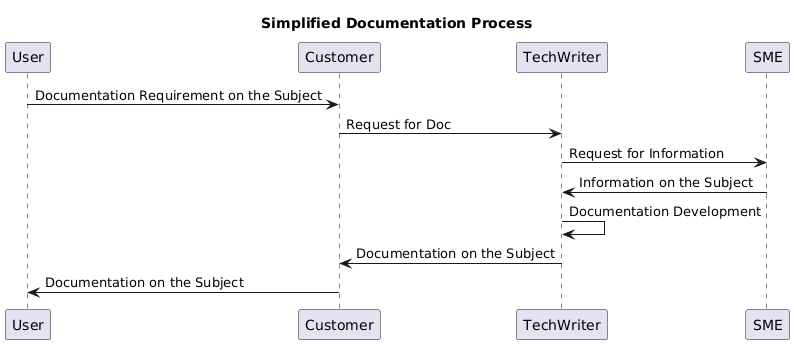
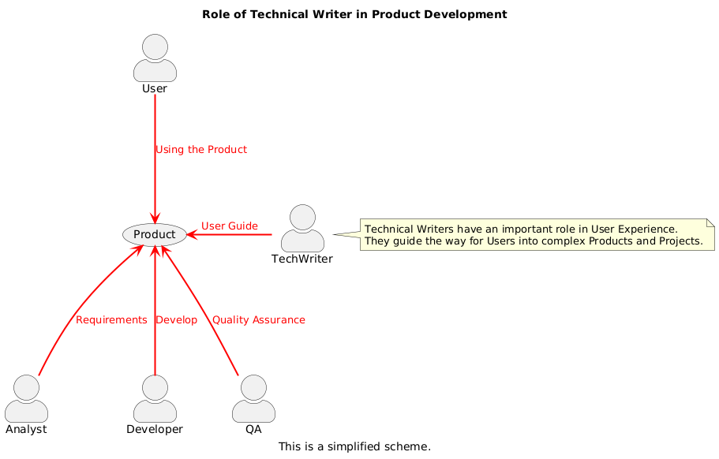
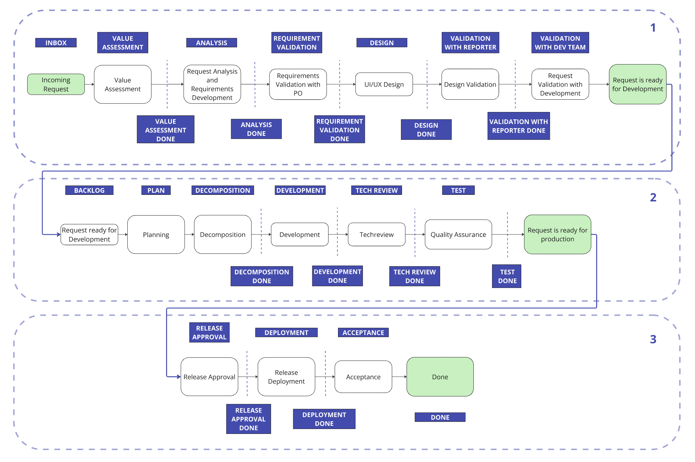

# Visualization

## Process Example Scheme



### Code (PlantUML)

```
@startuml

title Simplified Documentation Process

User->Customer: Documentation Requirement on the Subject

Customer->TechWriter: Request for Doc

TechWriter->SME: Request for Information

SME->TechWriter: Information on the Subject

TechWriter->TechWriter: Documentation Development

TechWriter->Customer: Documentation on the Subject

Customer->User: Documentation on the Subject

@enduml
```

## UML Example Scheme - Role of Technical Writer in Product Development



### Code (PlantUML)

```
@startuml

skinparam actorStyle awesome

title Role of Technical Writer in Product Development

caption This is a simplified scheme.

:TechWriter: -left--> (Product) #line:red;line.bold;text:red : User Guide

note right of TechWriter
Technical Writers have an important role in User Experience.
They guide the way for Users into complex Products and Projects.
end note

:User: -down--> (Product) #line:red;line.bold;text:red :  Using the Product

:Analyst: -up--> (Product) #line:red;line.bold;text:red :  Requirements

:Developer: -up--> (Product) #line:red;line.bold;text:red :  Develop


:QA: -up--> (Product) #line:red;line.bold;text:red : Quality Assurance

@enduml

```

## Example of a Work Process (Miro)


